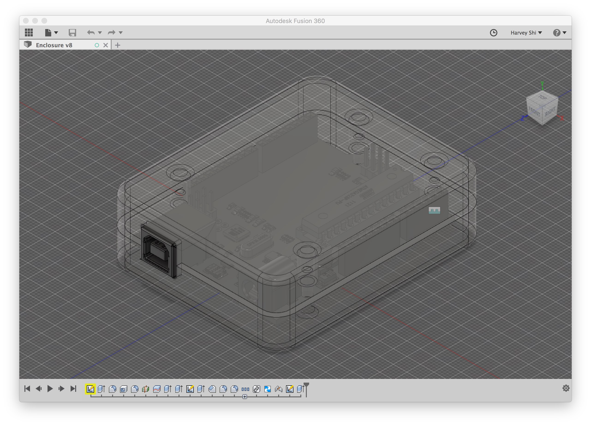

# BME 590 Finger Tremor Detector

**Team:** Harvey Shi, Sam Fox, Drew Levy

**Client:** Duke BME 590L - 003 class, Fall 2017

**Project goal:** To build a device to count the number of finger tremors with the patient's hand extended. We will be using the Arduino Uno microcontroller.

**Timeline:** This project is occurring between September - November 2017.

**CAD:** Note that the CAD work for this project is done in Fusion 360; therefore, the files cannot be easily saved locally. Thus, in lieu of the F360 files, we have included drawings of the CAD enclosure in the ./cad directory. Once the design is ready, we can make our F360 project public.

Figure 1: The basic enclosure design.
